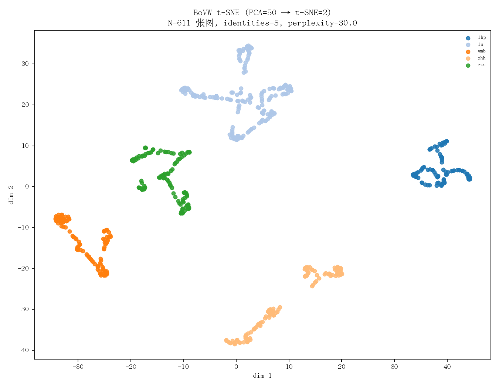
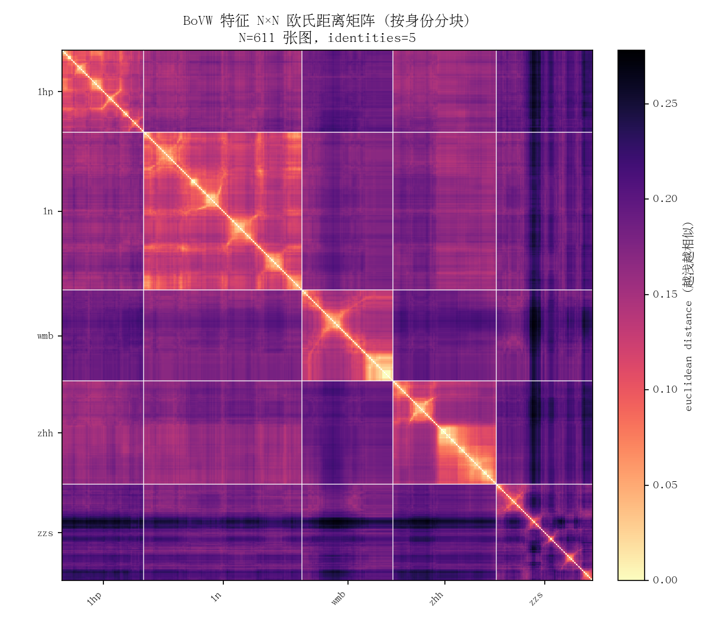

# l3_BoVW：基于 Dense-SIFT + K-Means 的人脸识别

## 1. 项目目的与算法原理

**目的**：实现人脸识别——给定一张查询图，从已建库的若干身份中找出最像的人。整体不依赖深度学习，只用经典视觉特征 + 词袋（BoVW）：**Dense-SIFT 提描述子**，**K-Means 训练视觉词典**，最后把图像表示成一个高维向量，按距离做最近邻匹配。

### 1.1 Dense-SIFT（密集 SIFT）

- **SIFT** 在每个关键点位置计算 **128 维**描述子，描述以该点为中心、固定半径邻域内的**梯度方向直方图**，对**亮度、小幅旋转/尺度变化**有较好的不变性。
- **稀疏 SIFT** 是先做角点/斑点检测再算描述子；脸上稳定关键点不多，会很稀。
- **Dense-SIFT** 则**不做检测**，**按事先给定的网格位置**（每个区域 5×5）直接取关键点；这样**每张图的描述子数量与位置完全一致**，便于后续做词频统计与跨图比较。

### 1.2 K-Means+BoVW（视觉词典）

- 把训练集所有 **128 维 Dense-SIFT 描述子**汇成一个大矩阵，跑 **K-Means** 聚成 *K* 个簇（默认 *K = 100*）；每个簇中心相当于一个**视觉词**，*K* 个簇中心组成共享**词典**。
- 推理时，每个 SIFT 描述子被分配到最近的视觉词；统计**词频直方图**，就把一张图变成了一个 *K* 维向量。这就是 **BoVW（Bag of Visual Words）**。

## 2. 文件架构

```
l3_BoVW/
├─ bovw.py                    # 3×3 分块 + Dense-SIFT + 视觉词分配 + L1/L2 归一化
├─ train_bovw.py              # 收集描述子 → K-Means 训练词典 → 编码每张库图 → 写出 npy
├─ match_face.py              # 单张查询图编码后与库做欧氏距离最近邻
├─ environment.yml            # Conda 环境定义（l3_bovw）
├─ .gitignore                 # 忽略 dataset/ 与 test/
├─ README.md
│
├─ dataset/                   # 训练数据：一人一文件夹（gitignore）
├─ test/                      # 查询图（gitignore）
├─ output/                    # 训练产物（npy）
│   ├─ label.npy              # 一维 object，每行 = 该库图所属人名（同一人多张图会重复）
│   ├─ features.npy           # (M, 900) float32，每行 = 一张图的 BoVW 向量（L2=1）
│   └─ visual_vocab.npy       # (100, 128) float32，K-Means 聚类中心 = 共享词典
│
└─ t-sne/                     # 可视化与诊断工具
    ├─ visualize.py                # PCA(50) → t-SNE(2) 散点图
    ├─ heatmap.py                  # N×N 欧氏距离热图，按身份排序分块
    ├─ visualize_with_queries.py   # 把 test/ 下的查询图与库一起做 t-SNE，看落在哪
    └─ output/                     # 图片产物
        ├─ tsne_scatter.png
        └─ distance_heatmap.png
```

## 3. 特征提取

固定预处理：**1920×1080 BGR** → 转灰度。

1. **3×3 分块**：把 1920×1080 灰度图按行主序均匀划成 9 个区域（左→右、上→下，编号 0…8）。
2. **每块独立 Dense-SIFT**：在每个区域内按 **5×5** 的固定网格取关键点，每点用 OpenCV 的 SIFT 计算 **128 维** 描述子（每块 25 个描述子，9 块共 225 个）。
3. **共享视觉词典**：训练时把**所有人、所有块**的全部 128 维描述子合并，统一跑 **K-Means(K=100)** 得到 *100 × 128* 的词典 `visual_vocab.npy`，**九块共用同一本词典**。
4. **每块 100 维 BoVW**：单图推理时，每块的 25 个描述子各自被分到最近的视觉词，统计成 **100 维**词频直方图，并做 **L1 归一化**（每块自己加和为 1，消除描述子总数差异）。
5. **拼接 → 900 维**：9 块的 100 维直方图按行主序拼成 **9 × 100 = 900 维**向量。
6. **整段 L2 单位化**：再对这个 900 维向量做 **L2 归一化**，使所有图以**单位长度**进库，便于做欧氏距离比较。

**已聚簇的可视化证据**（`t-sne/output/`）：

- `tsne_scatter.png`：把库中**每张图的 900 维**先用 PCA 降到 50 维，再用 t-SNE 投到 2 维。可以看到**同一身份的图基本聚成一团**，**不同身份的簇彼此分开**——说明 900 维特征对训练身份有清晰的可分性。
  
- `distance_heatmap.png`：把库特征按身份排序后，画 **N×N 欧氏距离矩阵**。**对角线上的方块明显更亮**（同身份距离小），**跨身份块**整体更暗（距离大），同样印证了「特征区分度存在」。
  

## 4. 迭代过程

在整个工程完善期间做了两次主要调整：

### 4.1 全图单一 BoVW → 3×3 空间分块

- **初期**：在整幅图上做 Dense-SIFT，整张图汇总成**一个** 100 维 BoVW。  
- **问题**：完全丢掉了「**眼睛在上半部、嘴巴在下半部**」这种**空间信息**；同一人在不同**姿态/角度**下，词频直方图彼此差距很大，**同身份的图在特征空间里不能稳定成簇**，反而被位置错配带得很散。  
- **改进**：引入 **3×3 分块**——每块单独统计 100 维直方图再拼接。这样表示中**带有粗粒度的空间结构**，与「五官位置大致稳定」的假设一致；改完之后**同身份的图开始成簇**，跨身份的可分性也明显提升。

### 4.2 身份级（每人一行求重心） → 图像级（每图一行）

- **初期**：把同一人的多张图编码后**逐维求平均**作为该人的「原型」，库里**一人一行**。  
- **问题**：求重心相当于把不同姿态的特征**平均掉**，**忽略了大量姿态/表情多样性**；很多 query 与某个原型的距离差别都不大，**不同身份的距离区分度被平均稀释**了。  
- **改进**：改为**每张图单独入库**，库里**一图一行**，`label[i]` 写该图所属人名。最近邻直接落在某张库图上，回查 `label` 得到身份。**改完之后区分度回升**（从 §3 的两张图也能直接看出）。

## 5. 当前问题与推测原因

### 现象

- 在**训练集内部**，特征对身份有很好的区分度（见 §3 的 t-SNE 与距离热图）。
- 但**对外部查询**：
  - 当 query 的**背景与库图差异较大**时，识别经常出错；
  - 当人物**佩戴的眼镜/帽子等装饰**与建库时不同时，识别也容易错。
  - 反过来，当**手动把背景裁掉、只留人脸**喂进去时，匹配立刻变得正确。

### 推测原因

1. **整张图都进了 BoVW，背景占了太多「词」**。3×3 分块下，**最外圈 8 块**主要包含背景与衣服；900 维里**只有大约 1/9 在描述「中心区域」**（可能是脸）。库图里同一身份背景往往一致（同一段视频/同一摄像头），词频被**背景同步**，模型其实是在**靠背景识人**——一旦换背景，就崩。
2. **Dense-SIFT 描述的是局部梯度纹理**，对**眼镜框、帽檐边缘**这种**强纹理新增物**非常敏感。眼镜变了相当于在脸的**关键位置**新增了大量边缘描述子，落到不同的视觉词上，直接拉偏直方图。
3. **强制 1920×1080 拉伸**：当前 `to_fixed_resolution` 直接 resize，对**长宽比不同**的 query（比如手机近景脸照）会**几何扭曲**，使 Dense-SIFT 取到的纹理结构与库图整体不一致——这相当于又叠了一层「分布偏移」。
4. **K-Means 词典学到的是「全图纹理」的平均**：词典里**真正描述脸部细节的视觉词比例不高**，很多词在描述背景/服装/边缘。这进一步放大了上面 1、2 两条的问题。

### 可能的改进方向（仅讨论，未实现）

- **预处理保持长宽比**：用 letterbox 缩放代替直接 resize，避免几何扭曲。  
- **加入人脸裁切**：用 OpenCV 自带 Haar 或 DNN 检测脸框，**只对脸内做 3×3 + Dense-SIFT**；这样背景和装饰不再主导特征。  
- **替换/补强特征**：对脸而言，HOG、LBP 这些更偏五官结构的特征，或换成预训练的人脸 embedding，会比通用纹理 BoVW 鲁棒得多。

## 6. 环境配置与工程运行

### 6.1 环境

```bash
conda env create -f environment.yml   # 配置环境
conda activate l3_bovw
```

依赖：**Python 3.11**、**NumPy**、**scikit-learn**、**OpenCV**（`conda-forge` 的 `opencv` 自带 SIFT）、**matplotlib**（用于 `t-sne/` 可视化脚本）。  

### 6.2 训练（生成图像库）

```bash
python train_bovw.py --dataset ./dataset --out ./output
```

输出：`output/{label.npy, features.npy, visual_vocab.npy}`。

可选参数：

- `--k-visual N`：每块直方图维度 / K-Means 的 K（默认 100，总维 = 9 × N）；
- `--max-train-samples N`：描述子极多时，先随机子采样 N 条再聚类（固定随机种子 42 可复现）。

### 6.3 推理（最近邻匹配）

```bash
python match_face.py /path/to/query.jpg
```

主要参数：

- `--art_dir`：库目录（默认 `./output`）；
- `--top_k`：输出前 K 行（同人多张图可能在 top-K 里重复出现）；
- `--print-stats`：打印与全库的距离统计（min / max / mean / std / 极差，以及 top1-top2 的差距），用于判断「是不是和谁的距离都差不多」。

### 6.4 可视化与诊断

```bash
python t-sne/visualize.py                  # PCA(50) → t-SNE(2) 散点图
python t-sne/heatmap.py                    # N×N 欧氏距离热图（按身份排序）
python t-sne/visualize_with_queries.py     # 把 test/ 下的查询图也画进 t-SNE，看落在哪
```

输出图片统一写到 `t-sne/output/`。